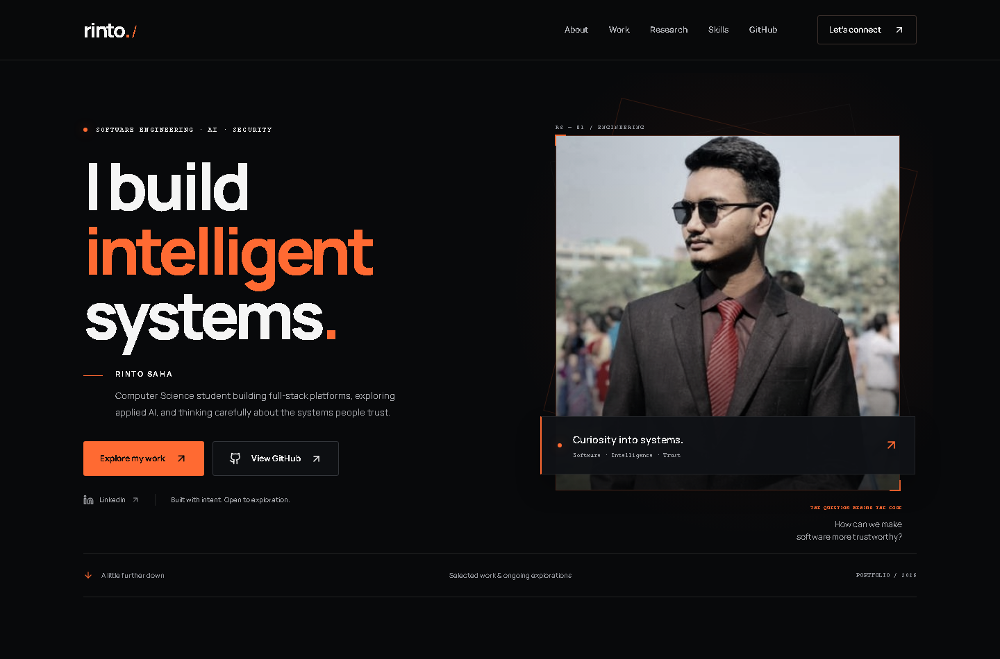

# Rinto Saha — Engineering Portfolio

A personal portfolio for software engineering, applied AI, and security interests. Built around verified public repositories, with an original graphite-and-orange identity, a real portrait, and accessible project walkthroughs.

[Visit the portfolio](https://saha-rinto-604.github.io/rinto-portfolio/) · [GitHub profile](https://github.com/saha-rinto-604)



## What is here

- Responsive portrait hero, biography, project stories, research interests, technology groups, academic work, and contact links.
- Expandable project engineering notes linking directly to source evidence.
- Self-hosted Manrope, SVG branding, PNG social preview, canonical metadata, sitemap, and robots file.
- Keyboard-accessible mobile navigation, visible focus, reduced-motion support, and a skip link.
- Static export and a verified GitHub Pages deployment workflow.

Project diagrams are explicitly labeled conceptual overviews. They are not fabricated application screenshots. Project maturity is stated; research interests do not imply publications or measured results.

## Stack and architecture

Next.js 16 App Router, React 19, TypeScript, Tailwind CSS 4, and Lucide. The page and its sections render statically; only mobile navigation requires client state. Motion uses CSS. There is no backend, analytics tracker, contact form, or runtime GitHub dependency.

```text
src/app/          Page, metadata, sitemap, robots, and visual tokens/styles
src/components/   Navigation and shared presentation primitives
src/sections/     Independent page sections
src/data/         Profile, project evidence, and technology content
src/lib/          Central URL and asset-path configuration
src/fonts/        Self-hosted Manrope and its OFL license
public/           Portrait, favicon, and brand assets
scripts/          Brand-asset generator and local static preview server
tests/            Playwright behavior, responsive, and axe accessibility checks
docs/             Public audit, design decisions, and verification notes
```

## Local development

Use Node.js 24 and npm.

```bash
npm ci
npm run dev
```

Open `http://localhost:3000/rinto-portfolio/`.

```bash
npm run lint
npm run typecheck
npm run build
npx playwright install chromium
npm test
npm run preview
```

The production export is `out/`. The local preview serves it at `http://127.0.0.1:4173/rinto-portfolio/` and intentionally returns 404 for nonexistent paths.

## Content and configuration

Edit `src/data/profile.ts` for biography, verified social links, research interests, and contact details. The optional email is empty and does not render a dead link. Edit `projects.ts` for projects and source evidence, and `skills.ts` for technology groups. Replace the portrait only with an authorized image of Rinto.

No secrets or environment variables are required. Optional build-time public settings:

| Variable | Default | Purpose |
| --- | --- | --- |
| `NEXT_PUBLIC_BASE_PATH` | `/rinto-portfolio` | GitHub Pages repository prefix; empty for a root domain |
| `NEXT_PUBLIC_SITE_URL` | `https://saha-rinto-604.github.io/rinto-portfolio` | Absolute canonical and social-preview base URL |

See `.env.example`. Do not store credentials in variables prefixed with `NEXT_PUBLIC_`.

## Deployment

GitHub Pages must use **GitHub Actions** as its source. Push to `main` to run lint, TypeScript, build, and six browser tests before deployment. Pull requests run the same checks without publishing. Pages permissions are confined to the deploy job.

For a future custom domain, set both public URL variables at build time, update the workflow and URL expectations in tests, add the owned domain in Pages settings, and rebuild. No domain ownership is assumed. Next.js `basePath` handles framework assets; public files use the central `asset()` helper. Image optimization is disabled because Pages serves static files.

## Checks and provenance

See [verification](docs/verification.md), [public repository audit](docs/github-audit.md), [design analysis](docs/design-analysis.md), and [naming recommendations](docs/repository-renaming-recommendations.md).

Portrait: Rinto Saha's public GitHub avatar, used without facial alteration. Manrope: SIL Open Font License, included with the font. Lucide: ISC license. The supplied inspiration image informed composition and color; none of its identity, claims, testimonials, or project imagery are reused. Private repository contents and local Clinora governing documents are excluded.
